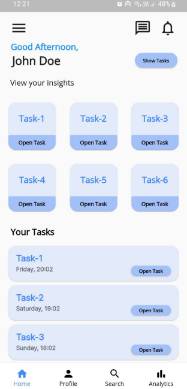
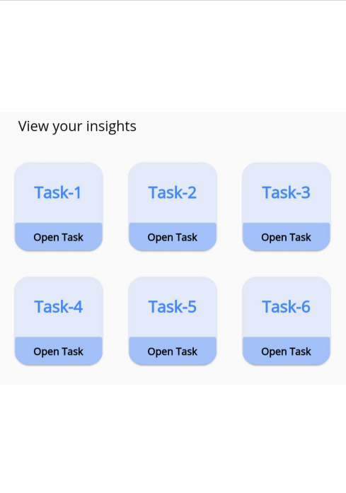
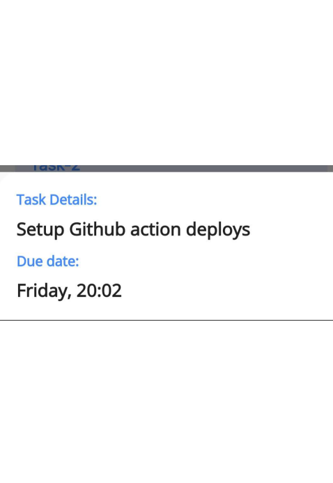
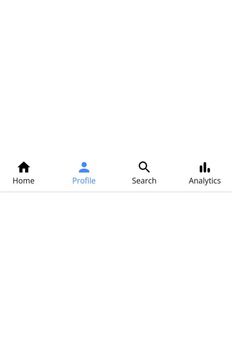

# TaskOrganiser 
Task Organiser is an application made for people to organise their tasks. The application helps user to view their assigned taks in a certain fashionly manner. They can viw the details of the task such as deadline and work assigned. 

<table>
  <tr>
    <td>Home Page</td>
     <td>Welcome View</td>
     <td>Task View</td>
  </tr>
  <tr>
    <td></td>
    <td></td>
    <td></td>
  </tr>
 </table>
 <table>
  <tr>
    <td>Detail View</td>
     <td>Navigation Bar</td>
     <td>Drawer Page</td>
  </tr>
  <tr>
    <td></td>
    <td></td>
    <td></td>
  </tr>
 </table>